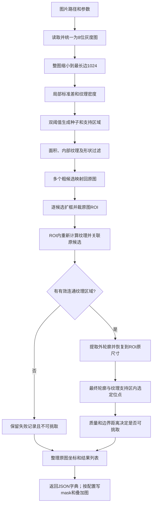

# 当前纹理规则：一张图片的处理流程

整理日期：2026-09-09。本文按当前代码说明实际行为，不代表原优化方案中的所有设想均已实现。

入口固定为 `vision.vision.detect_pipeline:process_image`。该入口执行手工纹理规则，不加载ONNX分类或分割模型。主要寻找内部有连续纹理且形状较紧密的候选团块。



## 1. 入口与读取

调用链是 `process_image → detect_from_path → load_gray_image → _detect_from_normalized_gray → detect_and_refine`。

`image_loader.py` 使用 `np.fromfile + cv2.imdecode`，支持中文路径。彩色图转灰度，alpha通道被移除，非uint8输入归一化到0–255。此步骤统一格式，不进行细胞识别。

`process_image` 未传out_dir时仅返回字典；会忽略模型专用参数model_dir、provider、allow_cpu_fallback、objective_name。规则计算后端由独立参数texture_backend选择。

## 2. 缩图和纹理信号

整图按比例缩到最长边不超过1024；例如5120×5120变成1024×1024。尺寸较小的图不放大。

`preprocess.texture_signal` 调用 `gpu_ops.texture_moments`，先在默认7×7窗口计算局部标准差：

```text
std = sqrt(max(mean(I²) - mean(I)², 0))
```

窗口内亮度起伏大，std较高；平滑区域较低。然后对std做21×21均值滤波，形成连续的纹理密度。密度代表邻域纹理强弱，不是细胞个数或多能性概率。

密度按第99百分位缩放为0–255热力图，再用Otsu估计阈值，并施加默认1.5灰度单位的绝对下限。设密度阈值为T、绝对下限为F：

```text
高纹理种子：density > max(1.5F, T)
较宽支持区：density > max(F, 0.65T)
```

支持区经过3×3闭运算和开运算，连接很小间隙、清理小碎片。另外计算 `max(F, std第40百分位×1.5)` 作为后续内部纹理检验下限。这里没有暗像素分位数种子，也不要求团块有暗中心。

## 3. 粗候选筛选

`texture_segment.coarse_texture_rois` 从支持区提取多个外轮廓，逐个筛选。默认条件如下，面积和距离均在粗检小图上计算：

| 条件 | 当前值或行为 |
|---|---|
| 轮廓面积 | 至少10000小图像素²；5120→1024时约对应250000原图像素² |
| bbox占整图面积比例 | 不超过30% |
| 短边/长边 | 至少0.15，过滤特别细长结构 |
| 内部区域 | 距外轮廓超过7×1.5=10.5小图像素，且至少16个像素 |
| 内部纹理覆盖率 | 内部std超过检验下限的比例至少55% |
| solidity | 轮廓面积/凸包面积至少0.45 |
| 种子证据 | 支持区内必须有高纹理种子 |
| 触边 | 默认允许，记录方向和截断状态；reject_border_touch=True则过滤 |

内部覆盖检查是为了降低“平滑黑圆只有一圈强边缘”造成的误判，并不等于已经可靠区分所有划痕和iPSC。

通过者计算 `confidence = coverage × (0.5 + 0.5×solidity)`，以支持区面积×confidence排序，同分按坐标稳定排序；max_keep默认不限制数量。此confidence是规则分数，不是模型概率。

当前只有纹理候选来源，没有暗候选合并路径，也没有基于bbox的NMS。每个候选保存独立的纹理支持mask和初步内部点，供后续关联；不把整张图缩成一个最大目标。

## 4. 裁ROI

`detect_pipeline.detect_and_refine` 把小图bbox和初步定位点映射回原图。点采用像素中心变换，bbox按半开端点映射，使用实际X/Y缩放比例。

对原图粗框每侧扩宽/高的20%，裁出全分辨率ROI；例如粗框1000×800，未触图边时ROI约1400×1120。超出图像的部分裁掉。粗框自身不先额外扩15%。

逐个ROI处理，不对整张5120大图做精分割。ROI处理工作尺寸最长边默认1200，可配置1600；它是从原图裁出后再按需缩小。

## 5. ROI内轮廓细化

`segment.refine_contour_in_roi` 转入 `texture_segment.refine_texture_roi`：重新计算ROI纹理，而不是直接放大粗检轮廓。

默认把粗检支持mask映射到ROI工作图中，适当膨胀为允许搜索区。在新纹理支持区的连通域中，要求含高纹理种子，并选择与粗候选支持区重叠最多的一块，减少误选旁边团块。再次执行内部纹理覆盖检查；不满足则返回细化失败。

通过后取该区域外轮廓、生成填充mask并恢复到ROI原尺寸。默认还受“粗框每侧扩5%”的矩形范围约束；外层ROI扩20%提供计算背景，不意味着最终轮廓能任意扩到整块ROI。

GrabCut默认关闭，显式开启grabcut/hybrid时最多2次。随后提取并简化最终外轮廓，重新栅格化，使输出多边形和轮廓mask一致。当前不再执行径向180向搜索或强制椭圆裁剪；旧暗核及径向调参已从接口移除，传入会报TypeError，调用方应删除这些参数。完整清单见 [参数清理说明](rule_vision_parameter_cleanup.md)。

外轮廓mask会填充内部孔洞；用于选点的纹理支持mask仍保留缺纹理区域，因此外轮廓包围范围和允许定位范围并不相同。没有足够分离证据的粘连团当前仍可能作为一个实例，没有自动强制拆分。

## 6. 定位点与可挑取状态

在“最终轮廓mask∩实际纹理支持mask”中做距离变换。图像/ROI边缘外补零，触边也会影响可用距离。排除距离小于 `max(1, safe_margin_px)` 的像素后，按下式选择分数最高的实际像素：

```text
选点分数 = 0.8×归一化边界距离 + 0.2×归一化纹理密度
```

因此更偏向远离边缘的内部纹理区，而不是最暗点或未经校验的质心。输出 `safe_clearance_px` 为该点距纹理支持区域边界的像素距离。

如果无足够余量，或者细化支持区面积不足映射后粗支持区的25%，目标被标为不可用于补偿。无足够余量时可保留轮廓内展示点，但有效性不会因展示点存在而恢复。完全细化失败时保留粗框和粗点、contour_points为空、confidence=0。

最终有效性结合粗检有效性、正轮廓面积和细化有效性；`is_pickable = (is_valid_for_compensation is not False)`。默认safe_margin_px=1只表示几何内部点要求，不是已经标定的机械挑取余量。

## 7. 原图坐标与输出

细化失败的候选仅保留在JSON中，叠加图不再绘制其红色粗框和粗定位点；已有细化轮廓及对应定位点继续绘制。

ROI轮廓和点加上裁剪左上角偏移，变回原图坐标。`center_pixel`和`safe_point`一致，供下游定位；`contour_center_pixel`另存几何质心。`bbox=[x,y,w,h]`、contour_points及area_px保持原接口。

所有成功/失败component最终按area_px降序排列；失败记录的area_px使用粗框面积，因此排序靠前不表示可挑取。`component_count`是记录数量，包含细化失败的候选，不能直接当成成功识别数。下游应读取显式有效性字段。

有out_dir时写 `05_contour_mask.bmp`、`06_overlay.bmp`、`07_result.json`；save_debug=True另写01–04，其中02保留旧文件名coarse_flat，但内容已是纹理密度。无out_dir时返回同类JSON字典，并跳过不需要的全图绘图缓冲区。

## 8. CPU/GPU负责哪部分

| 阶段 | 当前运行位置 |
|---|---|
| 读取、解码、灰度化、缩图 | CPU |
| 局部均值/平方均值、标准差、密度均值滤波 | 由texture_backend选择CPU或CUDA |
| 百分位、归一化、Otsu、形态学、连通域与轮廓 | CPU |
| 距离变换、定位点、坐标恢复、JSON和图片输出 | CPU |

默认cuda，要求GPU执行成功，否则报错；显式cpu使用CPU；auto尝试GPU，失败后记住原因并回退CPU。GPU传回的是纹理图，并非整条流水线都运行在GPU上。2026-09-09按用户要求将默认后端从CPU改为GPU，配置及启动说明见 [默认GPU使用说明](ipsc_gpu_default.md)。

主要源码：`detect_pipeline.py`负责串联；`image_loader.py`负责读取；`preprocess.py`和`gpu_ops.py`构造纹理；`texture_segment.py`负责候选、轮廓及选点；`feature_extract.py`和`postprocess.py`负责结果和落盘。上述文件均在 `vision/vision/` 下。
